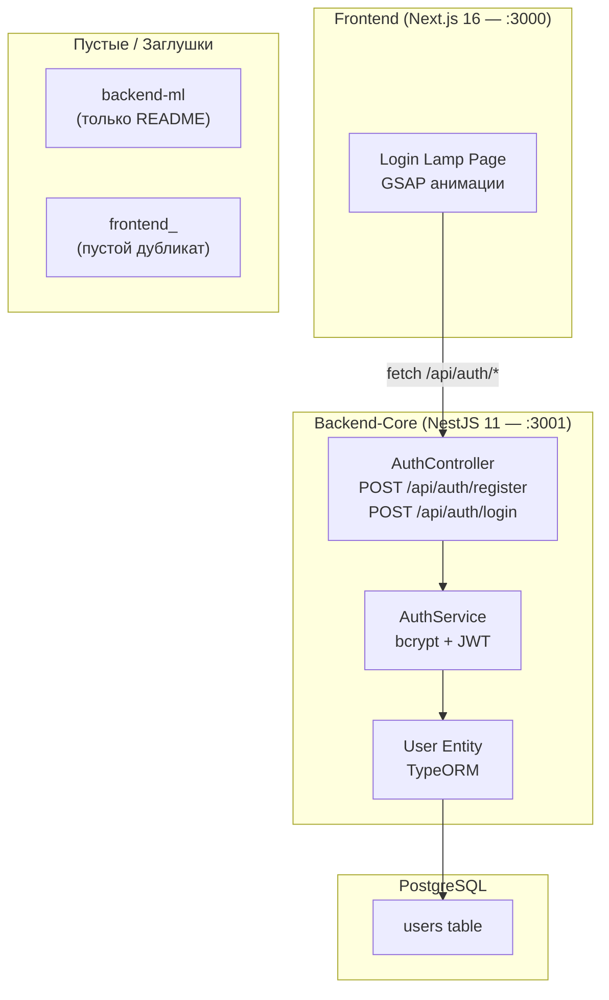

# 📊 Полный анализ проекта Full-Stack Marketplace

## Общая архитектура



---

## Что реально работает

### 1. Backend-Core (NestJS)

| Файл | Назначение |
|---|---|
| [main.ts](file:///c:/Users/%D0%A4%D1%8C%D1%88%D1%82/OneDrive/%D0%A0%D0%B0%D0%B1%D0%BE%D1%87%D0%B8%D0%B9%20%D1%81%D1%82%D0%BE%D0%BB/full-stack/backend-core/src/main.ts) | Точка входа, CORS для `localhost:3000`, глобальный префикс `/api`, порт `3001` |
| [app.module.ts](file:///c:/Users/%D0%A4%D1%8C%D1%88%D1%82/OneDrive/%D0%A0%D0%B0%D0%B1%D0%BE%D1%87%D0%B8%D0%B9%20%D1%81%D1%82%D0%BE%D0%BB/full-stack/backend-core/src/app.module.ts) | Подключение ConfigModule, TypeORM (PostgreSQL), AuthModule |
| [auth.controller.ts](file:///c:/Users/%D0%A4%D1%8C%D1%88%D1%82/OneDrive/%D0%A0%D0%B0%D0%B1%D0%BE%D1%87%D0%B8%D0%B9%20%D1%81%D1%82%D0%BE%D0%BB/full-stack/backend-core/src/auth/auth.controller.ts) | `POST /api/auth/register`, `POST /api/auth/login` |
| [auth.service.ts](file:///c:/Users/%D0%A4%D1%8C%D1%88%D1%82/OneDrive/%D0%A0%D0%B0%D0%B1%D0%BE%D1%87%D0%B8%D0%B9%20%D1%81%D1%82%D0%BE%D0%BB/full-stack/backend-core/src/auth/auth.service.ts) | Регистрация (bcrypt hash) и логин (bcrypt compare), выдача JWT |
| [jwt.strategy.ts](file:///c:/Users/%D0%A4%D1%8C%D1%88%D1%82/OneDrive/%D0%A0%D0%B0%D0%B1%D0%BE%D1%87%D0%B8%D0%B9%20%D1%81%D1%82%D0%BE%D0%BB/full-stack/backend-core/src/auth/jwt.strategy.ts) | Passport JWT стратегия (Bearer token из заголовка) |
| [jwt-auth.guard.ts](file:///c:/Users/%D0%A4%D1%8C%D1%88%D1%82/OneDrive/%D0%A0%D0%B0%D0%B1%D0%BE%D1%87%D0%B8%D0%B9%20%D1%81%D1%82%D0%BE%D0%BB/full-stack/backend-core/src/auth/jwt-auth.guard.ts) | Guard для защиты роутов (пока нигде не используется) |
| [user.entity.ts](file:///c:/Users/%D0%A4%D1%8C%D1%88%D1%82/OneDrive/%D0%A0%D0%B0%D0%B1%D0%BE%D1%87%D0%B8%D0%B9%20%D1%81%D1%82%D0%BE%D0%BB/full-stack/backend-core/src/users/user.entity.ts) | Entity `users`: id (UUID), email, password, role (user/admin), createdAt, updatedAt |
| [register.dto.ts](file:///c:/Users/%D0%A4%D1%8C%D1%88%D1%82/OneDrive/%D0%A0%D0%B0%D0%B1%D0%BE%D1%87%D0%B8%D0%B9%20%D1%81%D1%82%D0%BE%D0%BB/full-stack/backend-core/src/auth/dto/register.dto.ts) / [login.dto.ts](file:///c:/Users/%D0%A4%D1%8C%D1%88%D1%82/OneDrive/%D0%A0%D0%B0%D0%B1%D0%BE%D1%87%D0%B8%D0%B9%20%D1%81%D1%82%D0%BE%D0%BB/full-stack/backend-core/src/auth/dto/login.dto.ts) | DTO для регистрации/логина (email + password, **без валидации**) |

**Стек бэкенда:** NestJS 11, TypeORM 0.3, PostgreSQL (pg), Passport + JWT, bcrypt

---

### 2. Frontend (Next.js)

| Файл | Назначение |
|---|---|
| [page.tsx](file:///c:/Users/%D0%A4%D1%8C%D1%88%D1%82/OneDrive/%D0%A0%D0%B0%D0%B1%D0%BE%D1%87%D0%B8%D0%B9%20%D1%81%D1%82%D0%BE%D0%BB/full-stack/frontend/app/page.tsx) | Главная страница «Login Lamp» — SVG лампа с GSAP анимациями, форма логин/регистрация |
| [globals.css](file:///c:/Users/%D0%A4%D1%8C%D1%88%D1%82/OneDrive/%D0%A0%D0%B0%D0%B1%D0%BE%D1%87%D0%B8%D0%B9%20%D1%81%D1%82%D0%BE%D0%BB/full-stack/frontend/app/globals.css) | Дизайн-система: Inter шрифт, CSS-переменные, glassmorphism, адаптив |
| [layout.tsx](file:///c:/Users/%D0%A4%D1%8C%D1%88%D1%82/OneDrive/%D0%A0%D0%B0%D0%B1%D0%BE%D1%87%D0%B8%D0%B9%20%D1%81%D1%82%D0%BE%D0%BB/full-stack/frontend/app/layout.tsx) | Root layout с метаданными «Marketplace» |
| [next.config.ts](file:///c:/Users/%D0%A4%D1%8C%D1%88%D1%82/OneDrive/%D0%A0%D0%B0%D0%B1%D0%BE%D1%87%D0%B8%D0%B9%20%D1%81%D1%82%D0%BE%D0%BB/full-stack/frontend/next.config.ts) | Rewrite `/api/*` → `localhost:3001/api/*` (проксирование на бэкенд) |

**Стек фронтенда:** Next.js 16, React 19, GSAP 3, TailwindCSS 4

---

### 3. Пустые модули

| Папка | Содержимое |
|---|---|
| `backend-ml/` | Только `README.md` — задумка под Python ML-сервис |
| `frontend_/` | `package.json` с содержимым `{}` — **мусорная папка-дубликат** |

---

## ⚠️ Проблемы и замечания

### Критические

| # | Проблема | Где |
|---|---|---|
| 1 | **Нет валидации DTO** — `RegisterDto`/`LoginDto` не используют `class-validator`. Можно отправить пустые поля или мусор | `auth/dto/*.dto.ts` |
| 2 | **`synchronize: true`** в TypeORM — автосинхронизация схемы в проде удалит данные | `app.module.ts:26` |
| 3 | **JWT_SECRET = `super-secret-key-change-in-production`** — захардкожен слабый секрет | `.env:6` |
| 4 | **Fallback-secret** в коде — если `JWT_SECRET` пуст, используется `'fallback-secret'` | `jwt.strategy.ts:12`, `auth.module.ts:18` |

### Структурные

| # | Проблема | Где |
|---|---|---|
| 5 | **Корневой `package.json`** дублирует зависимости бэкенда (bcrypt, typeorm, pg и т.д.) — лишний | `full-stack/package.json` |
| 6 | **`frontend_/`** — пустая мусорная папка, нужно удалить | `full-stack/frontend_/` |
| 7 | **`JwtAuthGuard` создан, но нигде не применяется** — защищённых маршрутов нет | `jwt-auth.guard.ts` |
| 8 | **Нет `UsersService`** — вся логика работы с пользователями в `AuthService`. Для масштабирования стоит вынести | `users/` |
| 9 | **Токен хранится в `localStorage`** — уязвим к XSS. Лучше `httpOnly cookie` | `page.tsx:101` |

### Отсутствующие компоненты

| # | Чего нет |
|---|---|
| 10 | **Нет страниц маркетплейса** — только страница логина. Нет каталога, карточек товаров, корзины и т.д. |
| 11 | **Нет backend-ml** — рекомендательная система не начата |
| 12 | **Нет middleware для логирования / rate limiting / helmet** |
| 13 | **Нет Swagger/OpenAPI** для документации API |
| 14 | **Нет `class-validator` / `class-transformer`** в зависимостях бэкенда |
| 15 | **Нет тестов** — только шаблонный `app.controller.spec.ts` от NestJS CLI |
| 16 | **Нет `.env.example`** — другие разработчики не узнают нужные переменные |
| 17 | **Нет Docker / docker-compose** — локальный PostgreSQL нужно ставить вручную |
| 18 | **Нет роутинга на фронте** — одна страница, нет навигации |

---

## 📈 Что можно считать готовым

```
✅ Инициализация NestJS проекта
✅ Подключение к PostgreSQL через TypeORM
✅ Entity User с ролями (user/admin)
✅ Регистрация с хэшированием пароля (bcrypt)
✅ Логин с выдачей JWT токена
✅ JWT Strategy + Guard (заготовка)
✅ CORS настроен для фронтенда
✅ Глобальный префикс /api
✅ Next.js проект с проксированием на бэкенд
✅ Красивая Login Lamp страница с GSAP анимациями
✅ Glassmorphism дизайн с адаптивностью
✅ Форма логина/регистрации с обработкой ошибок
```

---

## 📊 Оценка готовности проекта

| Компонент | Статус | Прогресс |
|---|---|---|
| Аутентификация (backend) | Базово работает | 🟡 60% |
| Аутентификация (frontend) | Базово работает | 🟡 50% |
| Каталог товаров | Не начат | 🔴 0% |
| Рекомендательная система (ML) | Не начат | 🔴 0% |
| Корзина / Заказы | Не начат | 🔴 0% |
| Тесты | Не начат | 🔴 0% |
| DevOps (Docker, CI/CD) | Не начат | 🔴 0% |
| **Общий прогресс** | | **~10%** |
